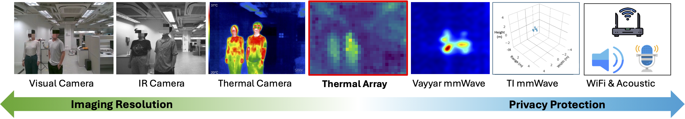
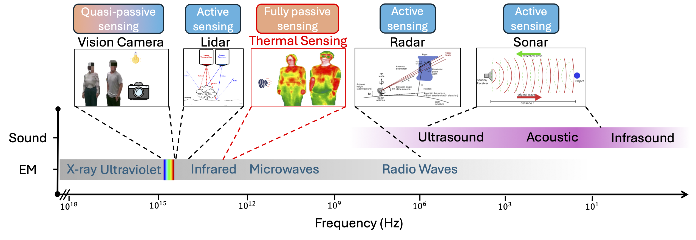
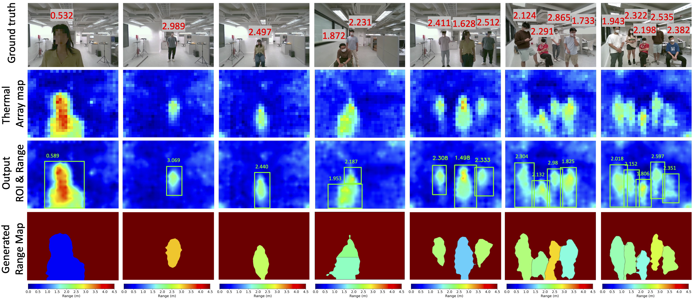

# TADAR

This repository contains the code for the [MobiHoc'24](https://www.sigmobile.org/mobihoc/2024/) paper:

> TADAR: Thermal Array-based Detection and Ranging for Privacy-Preserving Human Sensing

## From Sonar, Radar, Lidar, Widar to TADAR:
- Sonar: sound-based navigation and ranging;
- Radar: radio-based detection and ranging;
- Lidar: light-based detection and ranging;
- Widar: WiFi-based detection and ranging;
- **TADAR: Thermal array-based detection and ranging**.


**Modality Comparison:** Thermal array sensors strike a balance between imaging resolution and privacy protection for ubiquitous human sensing. The IR image is
from the IR module of the Realsense D455 depth camera. The mmWave imaging is done by a radar with 20 × 20 antennas. The 3D point cloud is generated by TI IWR1843 radar.


**Comparison of Non-contact Sensing Techniques:** Compared to widely used non-contact sensing techniques such as vision-based cameras, Lidar, Radar, and Sonar, thermal array-based sensing is fully passive, requiring no additional signal source.


**Results of TADAR:** We present TADAR, the first Thermal Array-based Detection and Ranging system that estimates the inherently missing range information for multi-user scenarios, extending thermal array outputs from 2D thermal pixels to 3D depths.

**The Demo Video is on https://youtu.be/0hGqzSYlh4o**

## Environment Setup
```
conda create -n tadar python=3.8.18
conda activate tadar
pip install -r requirements.txt
```

## Dataset

To obtain the dataset for this project, please access the provided [link](https://drive.google.com/drive/folders/1W6s4uIVd3ZRbgmoRzxf5zKAMinXRwjPW?usp=sharing) and save it in the root directory. The dataset consists of two files: Dataset.zip and Outputs.zip. Dataset.zip contains the original data gathered by the thermal array sensor, while Outputs.zip contains the results generated by TADAR.

## Running the Code

### Training the Thermal Ranging Model
```
python train.py
```
Note: The training process will generate the ranging model, which will be saved in the Models folder. This process may take some time. Alternatively, **you can use the pre-trained model provided in the Models folder**.

### Testing TADAR
```
python test.py
```
Note: The testing process will produce the detection and ranging results, which will be saved in the Outputs folder. This process may **take a significant amount of time**. We have provided the saved results in the link above, which **you can directly use to generate the main result figures mentioned in the paper**.

### Visualizing the Results
```
Run the visualization.ipynb
```
Note: The visualization.ipynb file will generate the main result figures mentioned in the paper.

## Citation
```
@inproceedings{Zhang2024TADAR,
  title = {{{TADAR}}: {{Thermal}} Array-Based Detection and Ranging for Privacy-Preserving Human Sensing},
  booktitle = {Proceedings of the 25th International Symposium on Theory, Algorithmic Foundations, and Protocol Design for Mobile Networks and Mobile Computing ({{MOBIHOC}} '24)},
  author = {Zhang, Xie and Wu, Chenshu},
  year = {2024},
  pages = {1--10},
  publisher = {ACM},
  address = {Athens, Greece},
  doi = {10.1145/3641512.3686357}
}
```
